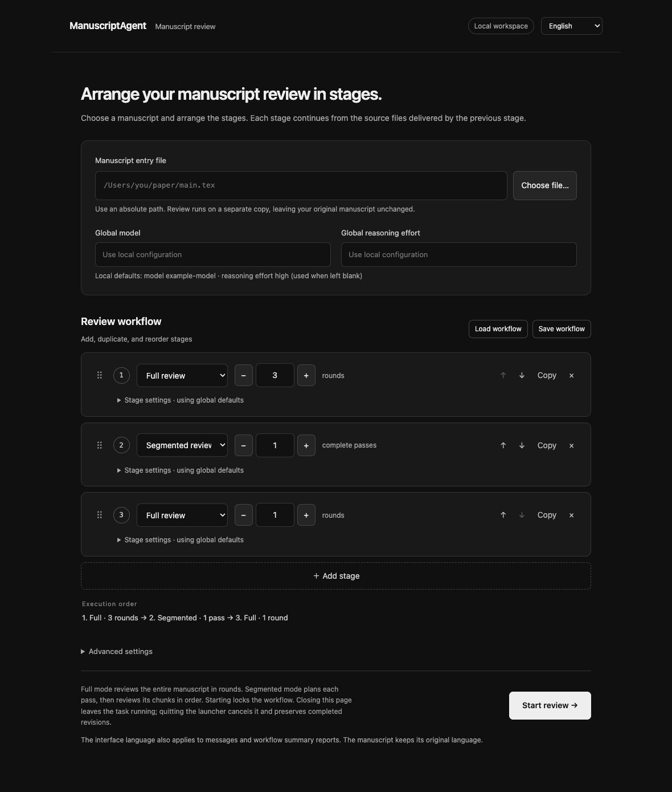

# ManuscriptAgent

[English](README.md) | [简体中文](README.zh-CN.md)

[](https://github.com/BrookWW/BrookWW-ManuscriptAgent/actions/workflows/ci.yml)

Review and revise mathematical LaTeX manuscripts through fresh, isolated Codex sessions. The local browser interface lets you arrange full-paper rounds and segmented passes into a workflow, follow its progress, and collect editable source revisions. The interface and operating messages are available in English and Simplified Chinese. Manuscripts retain their original language.

The bundled [mathematical manuscript skill](skill/mathematical-manuscript-agent/SKILL.md) handles mathematical reasoning, literature research, rewriting, and subagent review when useful. The Python runner collects dependencies, isolates sessions, schedules reviews, and saves results without changing the original files. Its editorial target is Annals of Mathematics or comparable journals; the [style preferences](skill/mathematical-manuscript-agent/references/personal-style.md) and template are author preferences, not official journal requirements. Completed execution does not certify mathematical correctness or publication readiness.

## Requirements and setup

- macOS with `sandbox-exec`. Linux, Windows, and execution without the sandbox are not supported.
- Python 3.11 or newer. The runner and local interface use the Python standard library; no web framework installation is needed.
- Codex CLI, installed and authenticated with the standard OpenAI provider and a regular `auth.json` file in its configured Codex home. Keychain-only authentication and custom model providers are not supported.
- Access to the model and reasoning effort selected for the run.

```sh
git clone https://github.com/BrookWW/BrookWW-ManuscriptAgent.git ManuscriptAgent
cd ManuscriptAgent
./manuscript-agent --help
```

The launchers look for Python 3.11+. If Codex is not on `PATH`, enter its absolute executable path in the interface's advanced settings or pass `--codex` to the CLI.

A TeX installation is optional. Delivery contains TeX/Bib sources and required assets, without a compiled manuscript PDF. Optional PDF reading tools are external dependencies: the runner can use supported system/Homebrew Poppler tools, a known bundled Poppler runtime, or the bundled Python text extractor when available. Unsupported tool locations are skipped without expanding filesystem access.

## Local browser interface

In Finder, double-click `Start ManuscriptAgent.command` for English or `启动 ManuscriptAgent.command` for Chinese. Keep the launcher's terminal window open while the task runs. The interface listens only on `127.0.0.1` and uses a random session token; it is a local service.



### Choose a language

Use the language selector at the top to switch between English and 中文. Switching updates labels, controls, progress messages, and operating messages without clearing the manuscript path or workflow settings. It does not translate the manuscript. Raw runner logs, model responses, and model-generated reports retain their original language. The workflow summary uses the language saved when the run starts.

The English and Chinese launchers select their respective initial languages. You can also start the interface directly:

```sh
python3 gui.py --language en
python3 gui.py --language zh-CN
```

Without `--language`, the interface first uses a language choice stored by the browser for that local address, then the browser language: Chinese selects `zh-CN`; other languages select `en`. Browser storage is scoped to the origin, including its port. The launcher normally chooses a free port, so a later launch may not share the earlier preference. `--port 8765` selects a fixed port; `--no-browser` prints the address without opening a browser.

### Set up a review

1. Select the entry `.tex` file or paste its absolute path. For an entry nested within a larger project, set the actual project root under advanced settings. Add dependencies that TeX discovery cannot find, one path per line.
2. Add full or segmented stages in any order. Duplicate or delete stages, drag them by the handle, or use the up/down buttons. The initial workflow of three full rounds, one segmented pass, and one full round is an editable example, not a validated optimum.
3. Choose global model, reasoning effort, and session timeout values. Blank model and reasoning fields inherit the local Codex configuration. Each stage can override the global model, reasoning effort, and session timeout.
4. Leave the output field empty to create a new directory under `runs/`, or specify a directory that does not yet exist. Selecting a parent folder fills in a new child directory name.
5. Start the review. The run's configuration is locked while it is active. Progress shows the current stage and round or block; the block total appears only after segmented planning succeeds. Use the report and folder buttons to inspect saved results.

| Stage mode | Meaning of its count | Session sequence |
|---|---|---|
| Full (`full`) | Number of complete-paper review rounds | One fresh audit session per round |
| Segmented (`segmented`) | Number of complete passes through the paper | Each pass starts a fresh planning session, then one fresh audit session per planned block |

Every audit receives the latest complete source bundle and saves a new revision on success. The workflow hands dependencies and nested entry paths between stages through actual revision directories. A failure stops the remaining stages.

For a segmented pass, the model chooses the blocks and their order. The plan stays fixed during that pass; planner edits to the manuscript are discarded. Each block session receives the complete manuscript, the read-only plan, and its assigned scope. It may consult other passages and repair directly affected material. Another pass creates a new plan. A full-paper review runs afterward only if you add a full stage. See the [segmented review guide](skill/mathematical-manuscript-agent/references/segmented-review.md).

### Save and reuse workflows

The save/load controls export and import JSON configuration. You can also load a completed or interrupted run's `workflow.json`; the interface reads its `config` field. Loading a configuration with a language setting also changes the interface language. Check local file paths, stage counts, and the output directory before starting a new run.

A minimal configuration can use your local model defaults:

```json
{
  "language": "en",
  "input": "/absolute/path/to/project/main.tex",
  "project_root": "/absolute/path/to/project",
  "assets": [],
  "stages": [
    {"mode": "full", "count": 3},
    {"mode": "segmented", "count": 1},
    {"mode": "full", "count": 1}
  ]
}
```

Optional global fields are `model`, `reasoning`, `timeout`, `build_timeout`, `codex`, and `output`. Stage overrides are `model`, `reasoning`, and `timeout`. Session timeout defaults to `7200` seconds; source-PDF text extraction defaults to `180` seconds. A model must be supplied globally, per stage, or in local Codex configuration. JSON field names and mode values stay the same in both interface languages.

### Stop and continue

Closing the browser leaves the task running. Stopping the run requests an interruption and waits for the isolated runner to clean up. Exiting the launcher also requests cancellation. Forced termination or power loss cannot guarantee cleanup. Completed revisions remain available.

After a failed or cancelled run that saved at least one audit revision, the continue control loads the last completed manuscript and the remaining stages for editing. Starting again creates a new run and repeats the entire current stage, including its configured rounds or passes. It does not restore the interrupted model session or automatically subtract completed rounds. Adjust the stage counts before restarting if needed.

After restarting the local service, load the saved `workflow.json`, set the input to `last_revision/last_entry`, and set the project root to `last_revision`. Keep the stages you want to run and choose a new output directory. If no audit revision was completed, start from the original source. Loading a saved configuration alone does not resume execution.

## Command-line use

The CLI runs one full stage or one segmented pass at a time. It keeps its existing English command help and logs; the interface language setting is not a manuscript CLI option.

Three complete-paper audit-and-revision rounds:

```sh
./manuscript-agent /absolute/path/to/main.tex \
  --mode full \
  --rounds 3 \
  --model gpt-6.1-sol \
  --reasoning xhigh \
  --output /absolute/path/to/audits/paper-full
```

To follow that run with one segmented pass, use its last completed revision:

```sh
./manuscript-agent /absolute/path/to/audits/paper-full/revisions/round-0003/main.tex \
  --mode segmented \
  --model gpt-6.1-sol \
  --reasoning xhigh \
  --output /absolute/path/to/audits/paper-segmented
```

Replace `main.tex` with the actual entry path. For a nested entry, set `--project-root` to the corresponding revision directory and repeat any necessary `--asset` options. Use an actual revision directory when continuing; do not use the `current` symlink as a project root. Both output directories must be new.

Do not pass `--rounds` in segmented mode. One CLI invocation executes the entire plan once, so a five-block plan creates one planning session and five audit sessions. Use separate invocations or the graphical workflow for multiple passes.

Full mode is the default. Omitting `--rounds` in that mode prompts for a count at the terminal. The example model and reasoning effort are explicit choices, not requirements. If omitted, they come from local Codex configuration; reasoning falls back to `high`. A model must be provided by the command or local configuration.

| Option | Meaning |
|---|---|
| `input` | Entry `.tex` file |
| `--mode full` | Audit the complete paper each round; default mode |
| `--rounds N` | Exact positive audit-round count in full mode only |
| `--mode segmented` | Plan blocks, then audit each block once |
| `--project-root PATH` | LaTeX working directory; defaults to the entry directory |
| `--asset PATH` | Extra dependency; repeatable, relative to the root or absolute within it |
| `--output PATH` | New run directory; defaults to `runs/<timestamp>-<id>/` |
| `--model NAME` | Override the locally configured model |
| `--reasoning LEVEL` | Override the locally configured reasoning effort |
| `--timeout SECONDS` | Maximum per Codex session, including planning; default `7200` |
| `--build-timeout SECONDS` | Maximum per source-PDF text extraction; default `180` |
| `--codex PATH` | Codex executable; default `codex` |

The session timeout is not a total-run budget. More rounds or planned blocks can increase runtime and model usage. Segmented review does not guarantee lower token use, lower cost, or better mathematical findings.

## Multi-file manuscripts and dependencies

The project root defines the LaTeX working directory and dependency boundary. Discovered dependencies retain their project-relative layout. Set extra assets for required files whose references cannot be discovered, such as macro-generated paths:

```sh
./manuscript-agent /absolute/path/to/project/paper/main.tex \
  --project-root /absolute/path/to/project \
  --asset figures/diagram.pdf \
  --asset tables/results.tex \
  --mode full \
  --rounds 3
```

The same paths can be entered in the interface's advanced settings. Explicit assets must remain inside the project root and are carried forward through subsequent rounds and stages. Only include manuscript dependencies.

Referenced `.bib` files are included automatically. If the manuscript has no external bibliography references, the skill still supplies `references.bib` at the working root; it may be empty. Unrelated bibliography files, downloads, review notes, caches, and logs are not passed forward.

## Output files

For a graphical workflow, the top-level output contains:

| Path | Contents |
|---|---|
| `workflow.json` | Saved configuration, stage results, status, and last completed revision/entry |
| `report.md` | Workflow summary in the saved run language, with links to stage results and round reports |
| `stage-NNN-pass-NNN.log` | Raw output from that runner invocation |
| `stage-NNN-pass-NNN/` | One full-stage run or one segmented-pass run |

Each stage/pass directory, or a standalone CLI output directory, contains:

| Path | Contents |
|---|---|
| `deliverables/` | Complete TeX/Bib sources and required assets after that runner finishes successfully; no compiled manuscript PDF |
| `revisions/round-0000/` | Input source bundle for that runner |
| `revisions/round-NNNN/` | Complete source bundle after each successful audit round |
| `current` | Symlink to the latest saved revision |
| `archive/round-NNNN/outcome.txt` | Round report and runner-generated list of files actually saved |
| `archive/round-NNNN/` | Execution logs, isolation preflight, and available multi-agent diagnostics |
| `review-plan.md` | Segmented mode's block schedule |
| `archive/planning/` | Segmented planning logs, report, preflight, and diagnostics |
| `run.json` | Mode, counts, status, entry path, and any execution error |

The final manuscript of a successful workflow is in the last stage/pass directory's `deliverables/`. The workflow does not create another top-level `deliverables/`. `workflow.json` also records the latest completed revision for recovery.

Reports rewrite local file links to saved revisions where possible; links to unsaved temporary files are marked as not delivered. The runner's saved-file list is authoritative, rather than a model's delivery claim alone.

A failed session, timeout, interruption, missing TeX/Bib output, or unsafe dependency prevents that round from counting. Earlier completed revisions remain available, and failed work is preserved where it can be read safely. Each runner exports `deliverables/` only after all its requested audits succeed. Full mode runs the exact requested count even if a round changes nothing. Segmented planning is not an audit round; invalid or unreadable plans stop the runner before auditing. Plan syntax checks do not certify the mathematical decomposition.

## Isolation and local data

Isolation applies to each execution session across both modes. Every planning or audit session receives a writable manuscript copy, private home, Codex state, and temporary directory. A macOS Seatbelt preflight checks access boundaries before the model starts. The original project, earlier archives, and unrelated user files are denied; the fixed skill, configuration, and review plan are read-only. Previous conversations, memories, plugins, and host bridges are not loaded.

Subagents within the same session share that session's sandbox and do not have separate file-permission boundaries. Across sessions and mode changes, the latest manuscript and its dependencies carry forward; conversation history and audit archives do not. Text deliberately written into the manuscript carries forward with it.

Model traffic uses a fixed-destination OpenAI relay. Optional literature downloads use an authenticated HTTPS broker with public-address and redirect checks. The relay restricts network destinations, not HTTP origins behind shared CDN addresses. Some macOS system/runtime files and required preferences services remain shared. This is not a virtual machine, and it does not isolate model/server-side state.

Trusted startup credentials are copied separately into each session. Agent-written authentication changes are neither passed forward nor written back to the user's login. If authentication expires, log in again and restart from a completed revision. After each session, the runner terminates its process group, closes proxies, and removes private directories. A deliberately detached descendant may outlive that process group while retaining its original sandbox restrictions.

Archives may contain manuscript text, model responses, and native session logs. Keep them private. `runs/`, agent state, and caches are excluded from version control; do not force-add them. Custom output locations must also remain outside published source control or be explicitly ignored. Runtime outputs are not part of the source release.

The best-effort multi-agent observer saves available session JSONL files and `agent-diagnostics.json` before cleanup. These records can show agent creation, execution, completion, and result receipt. Missing or partial logs do not establish that collaboration was absent, and observed collaboration does not certify mathematical quality. The observer does not archive authentication files or the complete private Codex home. Diagnostics are not passed to later sessions.

## Development and validation

Run the test suite with Python 3.11 or newer:

```sh
python3 -B -m unittest discover -s tests -v
```

Include macOS kernel-isolation tests with:

```sh
AUDITAGENT_SANDBOX_TESTS=1 python3 -B -m unittest discover -s tests -v
```

Kernel tests need permission to invoke `sandbox-exec` and bind local loopback sockets. Tests use synthetic manuscripts and fake model sessions, without a live mathematical audit.

The interface tests require Node.js 18 or newer, with no npm installation. Node.js is only a development-test dependency:

```sh
node --test tests/test_ui_i18n.js
```

The [Tests workflow](https://github.com/BrookWW/BrookWW-ManuscriptAgent/actions/workflows/ci.yml) runs on pushes and pull requests and can be started manually. It uses macOS 15 and Python 3.12, runs the Python and Node.js suites, enables kernel-isolation tests, checks the launchers, and rejects tracked run outputs, agent caches, and credentials. It needs no model credentials or live model calls. Optional checks can skip when locally bundled runtimes are unavailable; consult the run log for actual pass, failure, and skip counts.

See the [validation notes](docs/validation.md) for dated records and their limitations. Passing software tests verifies orchestration and source delivery; mathematical conclusions, reference accuracy, proof completeness, and editorial compliance require human review.
