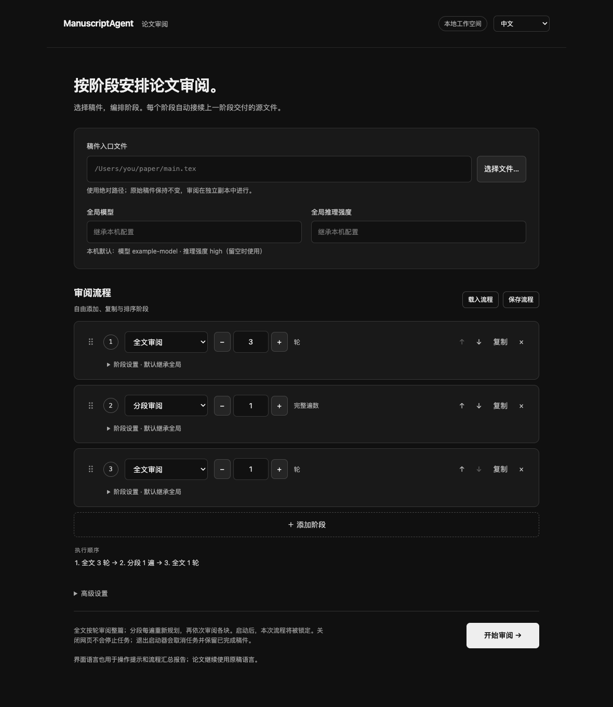

# ManuscriptAgent

[English](README.md) | [简体中文](README.zh-CN.md)

[](https://github.com/BrookWW/BrookWW-ManuscriptAgent/actions/workflows/ci.yml)

通过独立、隔离的 Codex 会话审阅和修订数学 LaTeX 论文。本地浏览器界面支持自由编排全文审阅和分段审阅，查看执行进度，并保存可继续编辑的源文件。界面和操作提示可选择简体中文或英文，论文沿用原稿语言。

内置的[数学论文技能](skill/mathematical-manuscript-agent/SKILL.md)负责数学推理、文献检索、改写，以及必要时的子智能体协作；Python 执行器负责收集依赖、隔离会话、调度审阅和保存结果，原始稿件保持不变。编辑目标参照 Annals of Mathematics 或同等级期刊，[写作偏好](skill/mathematical-manuscript-agent/references/personal-style.md)和模板属于作者偏好，并非期刊官方要求。流程完成不代表数学结论已获验证，也不代表稿件已达到发表标准。

## 环境要求与安装

- macOS，且系统提供 `sandbox-exec`。不支持 Linux、Windows 或关闭沙箱运行。
- Python 3.11 或更新版本。执行器和本地界面使用 Python 标准库，不需要安装网页框架。
- 已安装并登录的 Codex CLI，使用标准 OpenAI 服务商，且配置的 Codex 主目录内有普通文件 `auth.json`。不支持仅使用钥匙串保存的登录状态或自定义模型服务商。
- 账户能够使用运行时选择的模型和推理强度。

```sh
git clone https://github.com/BrookWW/BrookWW-ManuscriptAgent.git ManuscriptAgent
cd ManuscriptAgent
./manuscript-agent --help
```

启动器会查找 Python 3.11+。如果 `PATH` 中找不到 Codex，可在界面高级设置中填写可执行文件的绝对路径，或在命令行中使用 `--codex`。

TeX 环境是可选依赖。最终交付包括 TeX/Bib 源文件和必要资源，不导出编译后的论文 PDF。PDF 阅读工具也是外部可选依赖：程序可使用受支持的系统或 Homebrew Poppler 工具、已知的本机配套 Poppler 运行时，以及可用的配套 Python 文字提取器。未知位置的工具会被跳过，不会因此扩大文件系统访问范围。

## 本地图形界面

在 Finder 中双击 `启动 ManuscriptAgent.command`，以中文打开；双击 `Start ManuscriptAgent.command`，以英文打开。任务运行时请保留启动器的终端窗口。界面仅监听 `127.0.0.1`，使用随机会话令牌，是本地服务。



### 选择语言

通过顶部语言选择器切换“中文”与“English”。切换会更新标签、按钮、进度信息和操作提示，不会清空稿件路径或流程设置，也不会翻译论文。底层执行器日志、模型回复和模型生成的审阅报告保留原文。流程汇总报告使用启动该次运行时保存的语言。

中英文启动器分别指定对应的初始语言，也可以直接运行：

```sh
python3 gui.py --language zh-CN
python3 gui.py --language en
```

不指定 `--language` 时，界面优先使用浏览器为该本地地址保存的语言选择，其次依据浏览器语言：中文对应 `zh-CN`，其他语言对应 `en`。浏览器存储按来源区分，其中包含端口；启动器通常使用空闲端口，因此下一次启动未必能读取上次的选择。可用 `--port 8765` 指定固定端口，用 `--no-browser` 仅输出地址而不自动打开浏览器。

### 设置审阅流程

1. 选择稿件入口 `.tex` 文件，或粘贴其绝对路径。如果入口嵌套在较大的项目中，在高级设置里填写实际项目根目录。自动依赖扫描无法发现的必要文件，每行填写一个路径。
2. 按所需顺序添加全文或分段阶段。可以复制、删除阶段，通过拖动手柄或上下移动按钮排序。初始的“全文 3 轮、分段 1 遍、全文 1 轮”是可修改的示例，并非经过验证的最优流程。
3. 设置全局模型、推理强度和会话超时。模型和推理强度留空时读取本机 Codex 配置；各阶段可分别覆盖全局模型、推理强度和会话超时。
4. 输出位置留空时，在 `runs/` 下自动建立新目录；手动指定时，该目录必须尚不存在。选择父文件夹会自动填入一个新的子目录名称。
5. 开始审阅。运行期间锁定本次配置；进度显示当前阶段、轮次或分块，分块总数只在规划成功后显示。通过报告和结果文件夹按钮查看保存内容。

| 阶段模式 | 次数的含义 | 会话安排 |
|---|---|---|
| 全文（`full`） | 整篇论文的审阅轮数 | 每轮一个新的审阅会话 |
| 分段（`segmented`） | 完整审阅论文的遍数 | 每遍先开一个新的规划会话，再为计划中的每个分块开启独立审阅会话 |

每次审阅接收最新的完整源文件，成功后保存新版本。阶段之间通过真实的版本目录交接依赖和嵌套入口路径，任一阶段失败都会停止后续阶段。

分段模式由模型决定分块范围和顺序，每遍内部的计划固定，规划会话对论文的修改会被丢弃。分块审阅接收完整稿件、只读计划和指定范围，可以查阅其他段落并修复直接受影响的内容。下一遍会重新规划。需要在分段后再做全文审阅时，须添加全文阶段。具体规则见[分段审阅指南](skill/mathematical-manuscript-agent/references/segmented-review.md)。

### 保存和复用流程

通过保存和载入按钮导出、导入 JSON 配置。也可以载入已完成或中断任务的 `workflow.json`，界面会读取其中的 `config` 字段。载入包含语言设置的配置时，界面语言也会切换。重新运行前，请检查本机文件路径、阶段次数和输出目录。

以下最小配置使用本机默认模型：

```json
{
  "language": "zh-CN",
  "input": "/absolute/path/to/project/main.tex",
  "project_root": "/absolute/path/to/project",
  "assets": [],
  "stages": [
    {"mode": "full", "count": 3},
    {"mode": "segmented", "count": 1},
    {"mode": "full", "count": 1}
  ]
}
```

可选全局字段为 `model`、`reasoning`、`timeout`、`build_timeout`、`codex` 和 `output`。阶段覆盖字段为 `model`、`reasoning` 和 `timeout`。会话超时默认为 `7200` 秒，来源 PDF 文字提取超时默认为 `180` 秒。模型必须由全局配置、阶段配置或本机 Codex 配置提供。两种界面语言使用相同的 JSON 字段名和模式值。

### 停止和继续

关闭浏览器不会停止任务。停止运行会请求中断，并等待隔离执行器清理当前会话；退出启动器也会请求取消。强制终止进程或断电无法保证清理，已完成的版本仍会保留。

任务失败或取消后，如果已保存至少一个审阅版本，可通过继续按钮载入最后完成稿和剩余阶段，再编辑流程。再次开始会建立新任务，重新执行当前整个阶段，包括该阶段配置的全部轮数或遍数。它不会恢复中断的模型会话，也不会自动扣除已完成轮数；如有需要，请先调整次数。

本地服务重启后，可载入保存的 `workflow.json`，将稿件入口设为 `last_revision/last_entry`，项目根目录设为 `last_revision`，保留需要执行的阶段，并选择新的输出目录。如果还没有完成任何审阅版本，则从原稿开始。仅载入配置不会恢复执行。

## 命令行使用

命令行每次执行一个全文阶段或一遍分段审阅。它保留原有的英文帮助和日志；图形界面的语言设置不是论文执行器的命令行参数。

执行三轮完整的全文审阅与修订：

```sh
./manuscript-agent /absolute/path/to/main.tex \
  --mode full \
  --rounds 3 \
  --model gpt-6.1-sol \
  --reasoning xhigh \
  --output /absolute/path/to/audits/paper-full
```

随后从最后完成版本开始一遍分段审阅：

```sh
./manuscript-agent /absolute/path/to/audits/paper-full/revisions/round-0003/main.tex \
  --mode segmented \
  --model gpt-6.1-sol \
  --reasoning xhigh \
  --output /absolute/path/to/audits/paper-segmented
```

将 `main.tex` 换成实际入口路径。如果入口嵌套在子目录内，须将 `--project-root` 设为对应的版本目录，并重复必要的 `--asset` 参数。继续审阅时使用真实版本目录，不要把 `current` 符号链接作为项目根目录。两次输出目录都必须是新目录。

分段模式不能传入 `--rounds`。一次命令会执行一遍完整计划，因此五个分块会产生一个规划会话和五个审阅会话。需要多遍审阅时，分别执行命令，或使用图形界面编排。

默认模式是全文审阅；此时省略 `--rounds`，终端会询问轮数。示例模型和推理强度是显式选择，并非程序要求；省略时读取本机 Codex 配置，推理强度未配置时使用 `high`。模型必须在命令或本机配置中指定。

| 参数 | 含义 |
|---|---|
| `input` | 入口 `.tex` 文件 |
| `--mode full` | 每轮审阅整篇论文；默认模式 |
| `--rounds N` | 全文模式的精确审阅轮数，须为正整数 |
| `--mode segmented` | 先规划分块，再按顺序各审阅一次 |
| `--project-root PATH` | LaTeX 工作目录；默认是入口文件所在目录 |
| `--asset PATH` | 额外依赖，可重复；相对于项目根目录，或使用根目录内的绝对路径 |
| `--output PATH` | 新的运行目录；默认 `runs/<timestamp>-<id>/` |
| `--model NAME` | 覆盖本机默认模型 |
| `--reasoning LEVEL` | 覆盖本机默认推理强度 |
| `--timeout SECONDS` | 每次 Codex 会话的最长时间，包括规划；默认 `7200` |
| `--build-timeout SECONDS` | 每次来源 PDF 文字提取的最长时间；默认 `180` |
| `--codex PATH` | Codex 可执行文件；默认 `codex` |

会话超时不是整个任务的时间预算。轮数或分块增加可能提高总耗时和模型用量，分段审阅不保证节省词元、降低费用或获得更好的数学审阅结果。

## 多文件稿件与依赖

项目根目录定义 LaTeX 工作目录和依赖边界，自动发现的文件保留相对于项目根目录的布局。程序无法识别的必要文件，例如由宏生成路径的资源，可显式添加：

```sh
./manuscript-agent /absolute/path/to/project/paper/main.tex \
  --project-root /absolute/path/to/project \
  --asset figures/diagram.pdf \
  --asset tables/results.tex \
  --mode full \
  --rounds 3
```

这些路径也可填入图形界面的高级设置。显式依赖必须位于项目根目录内，并会继续传给后续轮次和阶段；请仅添加稿件必需的文件。

引用的 `.bib` 文件会自动包含。论文没有外部文献库引用时，技能仍会在工作根目录提供 `references.bib`，该文件可以为空。无关的文献库文件、下载内容、审阅笔记、缓存和日志不会向后传递。

## 输出文件

图形界面流程的顶层输出包括：

| 路径 | 内容 |
|---|---|
| `workflow.json` | 保存的配置、阶段结果、状态，以及最后完成版本和入口路径 |
| `report.md` | 使用运行时保存语言的流程汇总，包含阶段结果和各轮报告链接 |
| `stage-NNN-pass-NNN.log` | 该次执行器调用的原始日志 |
| `stage-NNN-pass-NNN/` | 一个全文阶段或一遍分段审阅的输出 |

每个阶段或遍数目录，以及独立命令行任务的输出目录，包含：

| 路径 | 内容 |
|---|---|
| `deliverables/` | 该次执行器成功结束后的完整 TeX/Bib 源文件和必要资源，不含编译后的论文 PDF |
| `revisions/round-0000/` | 该次执行器的输入源文件副本 |
| `revisions/round-NNNN/` | 每次审阅成功后保存的完整源文件 |
| `current` | 指向最后保存版本的符号链接 |
| `archive/round-NNNN/outcome.txt` | 本轮报告和执行器生成的实际保存文件清单 |
| `archive/round-NNNN/` | 执行日志、隔离预检和可获取的多智能体诊断记录 |
| `review-plan.md` | 分段模式的分块计划 |
| `archive/planning/` | 分段规划的日志、报告、隔离预检和诊断记录 |
| `run.json` | 模式、次数、状态、入口路径及执行错误 |

流程成功后，最终稿位于最后一个阶段或遍数目录的 `deliverables/` 中；流程顶层不会再创建一份 `deliverables/`。`workflow.json` 也会记录最后完成版本，供恢复时使用。

报告会尽可能将本地文件链接改为已保存版本的路径；指向未保存临时文件的链接会注明未交付。以执行器生成的文件清单为准，不能仅依赖模型声称已完成交付。

会话失败、超时、中断、缺少 TeX/Bib 输出或出现不安全依赖时，该轮不计为完成。此前完成的版本仍可使用，失败现场中能够安全读取的内容会尽量保留。每次执行器只有在全部审阅成功后才导出 `deliverables/`。全文模式严格执行指定轮数，即使某轮没有修改。分段规划不计入审阅轮数；计划无效或不可读时会在审阅前停止。计划语法检查不验证数学分块是否合理。

## 隔离与本地数据

两种模式均按执行会话隔离。每次规划或审阅都有自己的可写稿件副本、主目录、Codex 状态和临时目录，启动模型前通过 macOS Seatbelt 预检访问边界。原始项目、此前归档和无关用户文件不可访问；固定技能、配置和审阅计划只读。旧对话、记忆、插件和宿主桥接不会载入。

同一会话内的子智能体共用该会话沙箱，彼此没有独立的文件权限边界。跨会话或切换模式时，最新稿件及其依赖继续传递，对话历史和审阅归档不传递；明确写进稿件的文字也会随稿件保留。

模型流量通过限定目标的 OpenAI 中继发送。可选的文献下载通过带认证的 HTTPS 代理，检查公网地址和重定向。中继限制网络目标，不能区分共享 CDN 地址后的所有 HTTP 来源。部分 macOS 系统和运行时文件、必要的偏好服务仍然共享。这不是虚拟机，也不能隔离模型或服务端状态。

每个会话分别复制可信的启动凭据。智能体改写的认证信息不会传给后续会话，也不会回写用户登录配置。认证过期时，重新登录后从已完成版本开始。每次会话结束后，执行器终止其进程组、关闭代理并删除私有目录。刻意脱离原进程组的后代进程可能继续存活，但仍受原沙箱限制。

归档可能含有论文内容、模型回复和原生会话日志，应保存在私人位置。版本控制已排除 `runs/`、智能体状态和缓存，请勿强制加入；自定义输出目录也应位于公开版本控制范围之外，或明确加入忽略规则。运行产物不属于源码发布内容。

多智能体观察器会在清理前尽力保存可获取的会话 JSONL 和 `agent-diagnostics.json`，记录智能体创建、执行、结束及结果接收的证据。记录缺失或不完整不能证明没有协作，记录到协作也不能证明数学质量。观察器不归档认证文件或整个私有 Codex 主目录，诊断记录不会传给后续会话。

## 开发与验证

使用 Python 3.11 或更新版本运行测试：

```sh
python3 -B -m unittest discover -s tests -v
```

包含 macOS 内核隔离测试：

```sh
AUDITAGENT_SANDBOX_TESTS=1 python3 -B -m unittest discover -s tests -v
```

内核测试需要调用 `sandbox-exec` 和绑定本地回环端口的权限。测试使用合成稿件和模拟模型会话，不执行真实数学审阅。

界面测试需要 Node.js 18 或更新版本，无须安装 npm 依赖。Node.js 仅用于开发测试，正常使用不需要：

```sh
node --test tests/test_ui_i18n.js
```

[测试工作流](https://github.com/BrookWW/BrookWW-ManuscriptAgent/actions/workflows/ci.yml)在推送和拉取请求时运行，也可手动启动。它使用 macOS 15 和 Python 3.12，运行 Python 和 Node.js 测试、启用内核隔离测试、检查启动器，并拒绝提交运行产物、智能体缓存和凭据。它不需要模型凭据，也不调用真实模型。部分可选检查会在缺少本机配套运行时的环境中跳过，实际通过、失败和跳过数量以该次日志为准。

[验证记录](docs/validation.md)保留了各日期的检查结果和限制。软件测试通过能够验证调度与源文件交付；数学结论、文献准确性、证明完整性和编辑要求的落实仍需人工检查。
